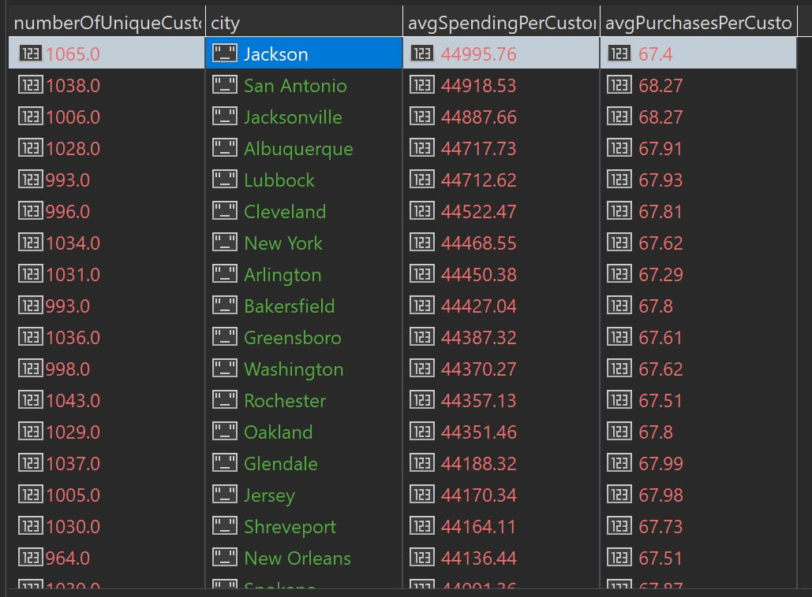
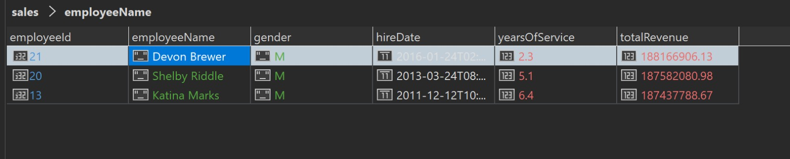
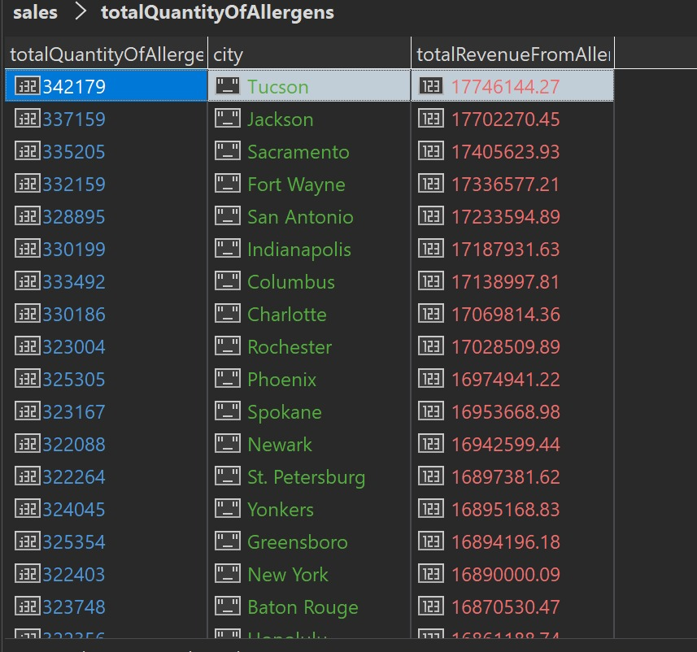
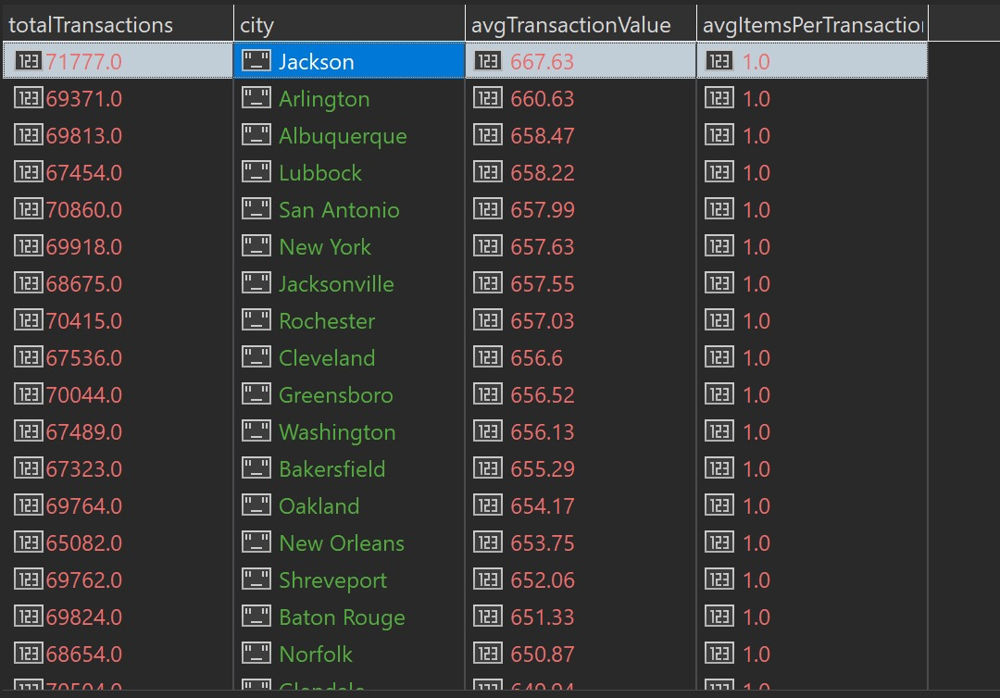
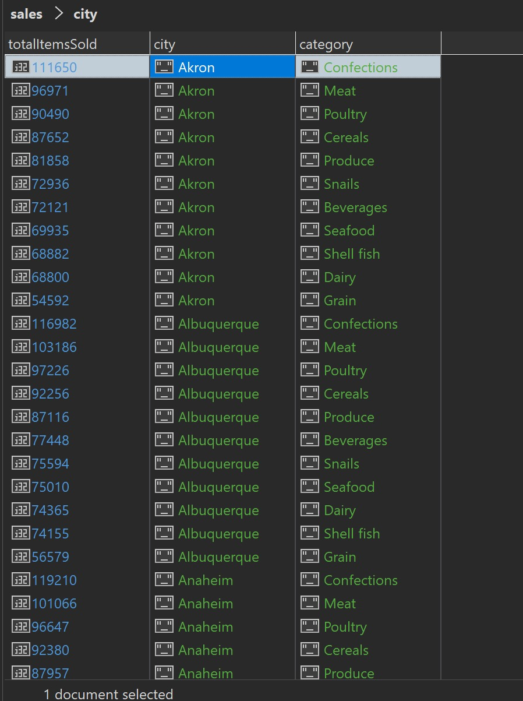

## Upiti

# 1. Koliki je prosečan broj kupovina i prosečna ukupna potrošnja (TotalPrice) po kupcu u različitim gradovima? Identifikovati gradove sa "najlojalnijim" (najviše kupovina/potrošnje) kupcima.

```
db.getCollection("sales").aggregate([
    {
        $group: {
            _id: '$CustomerID',
            totalSpentByCustomer: { $sum: '$TotalPrice' },
            numberOfPurchases: { $sum: 1 }
        }
    },
    {
        $lookup: {
            from: 'customers',
            localField: '_id', // _id sada sadrži CustomerID
            foreignField: '_id',
            as: 'customerInfo'
        }
    },
    {
      $match: {
          'customerInfo': { $ne: [] }
      }
    },
    { $unwind: '$customerInfo' },
    {
        $group: {
            _id: '$customerInfo.Location.CityName',

            avgSpendingPerCustomer: { $avg: '$totalSpentByCustomer' },

            avgPurchasesPerCustomer: { $avg: '$numberOfPurchases' },

            numberOfUniqueCustomers: { $sum: 1 }
        }
    },
    {
        $sort: {
            'avgSpendingPerCustomer': -1
        }
    },
    {
        $project: {
            _id: 0,
            city: '$_id',
            avgSpendingPerCustomer: { $round: ['$avgSpendingPerCustomer', 2] },
            avgPurchasesPerCustomer: { $round: ['$avgPurchasesPerCustomer', 2] },
            numberOfUniqueCustomers: 1
        }
    }
])
```

Rezultat upita:

Top 3 grada sa najlojalnijim kupcima: Jackson, San Antonio, Jacksonville
Vreme izvršavanja 8.2s.

# 2. Koji su top 3 zaposlena (SalesPerson) po ukupnoj prodaji (TotalPrice)? Uporediti njihove demografske podatke (pol, datum zaposlenja) sa prosekom svih zaposlenih.

```
// racunanje poslednji datum
db.getCollection("sales").find({}, { _id: 0, SalesDate: 1 }).sort({ "SalesDate": -1 }).limit(1)

// racunamo prosek staza rada generalno
db.getCollection("employees").aggregate([

    {
        $addFields: {
            yearsOfService: {
                $divide: [
                    { $subtract: [ISODate("2018-05-09T23:59:59.400Z"), '$HireDate'] },
                    1000 * 60 * 60 * 24 * 365
                ]
            }
        }
    },

    { $group: { _id: null, averageYearsOfService: { $avg: '$yearsOfService' } } },
    { $project: { _id: 0, averageYearsOfService: { $round: ['$averageYearsOfService', 1] } } }
])

// glavni upit

db.getCollection("sales").aggregate([
    { $group: { _id: '$SalesPersonID', totalRevenue: { $sum: '$TotalPrice' } } },
    { $sort: { totalRevenue: -1 } },
    { $limit: 3 },
    { $lookup: { from: 'employees', localField: '_id', foreignField: '_id', as: 'employeeInfo' } },
    { $unwind: '$employeeInfo' },


    {
        $project: {
            _id: 0,
            employeeId: '$_id',
            employeeName: { $concat: ['$employeeInfo.FirstName', ' ', '$employeeInfo.LastName'] },
            gender: '$employeeInfo.Gender',
            hireDate: '$employeeInfo.HireDate',
            yearsOfService: {
                $round: [{
                    $divide: [
                        { $subtract: [ISODate("2018-05-09T23:59:59.400Z"), '$employeeInfo.HireDate'] },
                        1000 * 60 * 60 * 24 * 365
                    ]
                }, 1]
            },
            totalRevenue: { $round: ['$totalRevenue', 2] }
        }
    }
])

```

Rezultat upita:

Top 3 zaposlena: Svi muskarci, prosek zaposlenih kod najboljeg manji od proseka, kod ostala dva veći.
Vreme izvršavanja 3.4s.

# 3. Koliko se proizvoda označenih kao IsAllergic prodaje u svakom gradu, po Quantity i TotalPrice? Koji gradovi imaju najveću prodaju alergijskih proizvoda?

```
db.getCollection("sales").aggregate([
    {
        $lookup: {
            from: 'products',
            localField: 'ProductID',
            foreignField: '_id',
            as: 'productInfo'
        }
    },
    { $unwind: '$productInfo' },
    {
        $match: {
            'productInfo.IsAllergic': 'True'
        }
    },
    {
        $lookup: {
            from: 'customers',
            localField: 'CustomerID',
            foreignField: '_id',
            as: 'customerInfo'
        }
    },
    { $unwind: '$customerInfo' },
    {
        $group: {
            _id: '$customerInfo.Location.CityName',
            totalRevenueFromAllergens: {
                $sum: '$TotalPrice'
            },
            totalQuantityOfAllergens: {
                $sum: '$Quantity'
            }
        }
    },
    {
        $sort: {
            'totalRevenueFromAllergens': -1
        }
    },
    {
        $project: {
            _id: 0,
            city: '$_id',
            totalRevenueFromAllergens: { $round: ['$totalRevenueFromAllergens', 2] },
            totalQuantityOfAllergens: 1
        }
    }
])
```

Rezultat upita:

Top 3 grada po prodaji alergijskih proizvoda: Tucson, Jackson, Sacramento
Vreme izvršavanja 401s.

# 4. Kakav je prosečan 'sadržaj korpe' po različitim gradovima? Analizirati prosečan broj stavki po transakciji i prosečnu vrednost jedne transakcije za svaki grad.

```
db.getCollection("sales").aggregate([
    {
        $group: {

            _id: '$TransactionNumber',
            transactionValue: { $sum: '$TotalPrice' },
            itemsInTransaction: { $sum: 1 },
            customerID: { $first: '$CustomerID' }
        }
    },
    {
        $lookup: {
            from: 'customers',
            localField: 'customerID',
            foreignField: '_id',
            as: 'customerInfo'
        }
    },
    {
        $match: { 'customerInfo': { $ne: [] } }
    },
    { $unwind: '$customerInfo' },

    {
        $group: {
            _id: '$customerInfo.Location.CityName',

            avgTransactionValue: { $avg: '$transactionValue' },
            avgItemsPerTransaction: { $avg: '$itemsInTransaction' },

            totalTransactions: { $sum: 1 }
        }
    },
    {
        $sort: {
            'avgTransactionValue': -1
        }
    },

    {
        $project: {
            _id: 0,
            city: '$_id',
            avgTransactionValue: { $round: ['$avgTransactionValue', 2] },
            avgItemsPerTransaction: { $round: ['$avgItemsPerTransaction', 2] },
            totalTransactions: 1
        }
    }
])
```

Rezultat upita:

Vreme izvršavanja 169s.

# 5. Izracunati za svaki grad i svaku kategoriju koliko se proizvoda iz date kategorije prodalo po gradu. Koja kategorija proizvoda je najprodavanija?

```
db.getCollection("sales").aggregate([
    {
        $lookup: {
            from: 'products',
            localField: 'ProductID',
            foreignField: '_id',
            as: 'productInfo'
        }
    },
    { $unwind: '$productInfo' },
    {
        $lookup: {
            from: 'customers',
            localField: 'CustomerID',
            foreignField: '_id',
            as: 'customerInfo'
        }
    },
    { $unwind: '$customerInfo' },
    {
        $group: {
            _id: {
                city: '$customerInfo.Location.CityName',
                category: '$productInfo.Category.CategoryName'
            },
            totalItemsSold: { $sum: '$Quantity' },

        }
    },
     {
        $sort: {
            '_id.city': 1,
            'totalItemsSold': -1
        }
    },

    {
        $project: {
            _id: 0,
            city: '$_id.city',
            category: '$_id.category',
            totalItemsSold: 1,
        }
    }
])
```

Rezultat upita:

Vreme izvršavanja 343.
