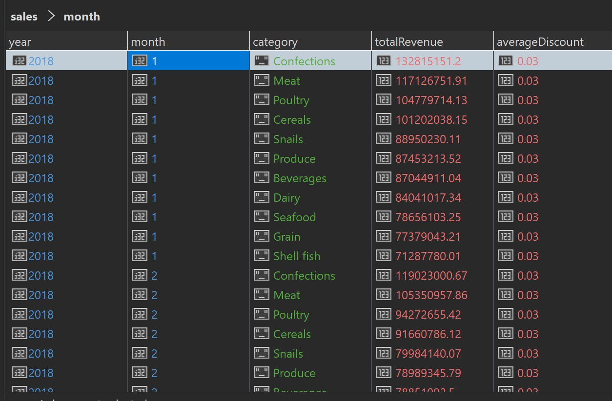
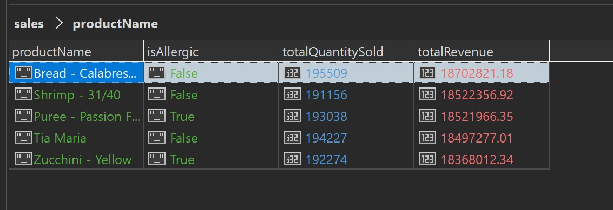
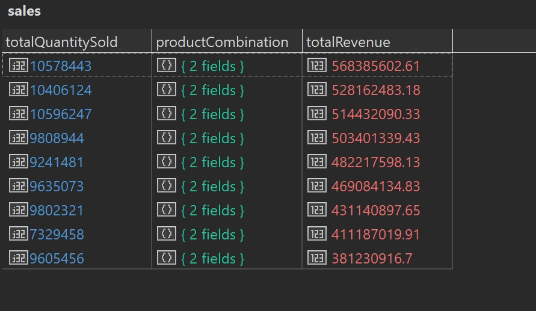
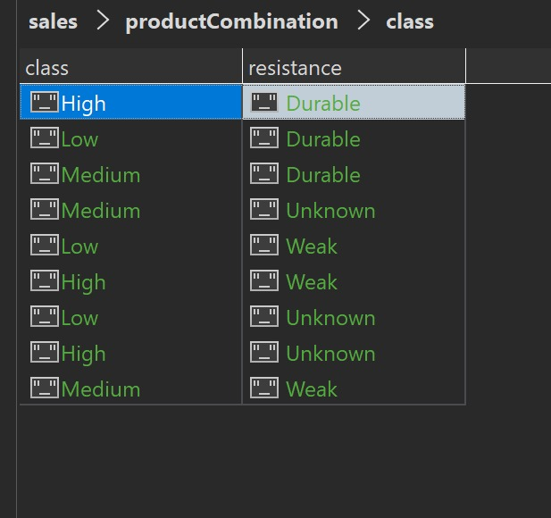
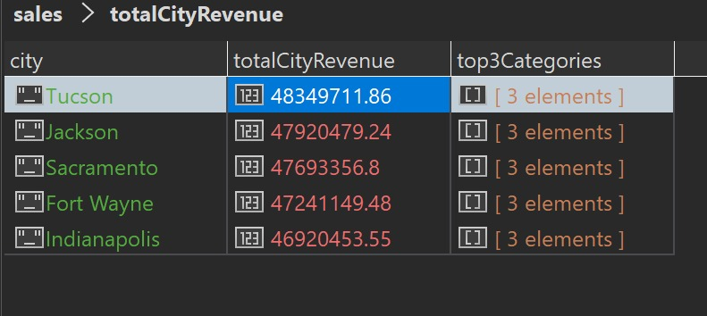
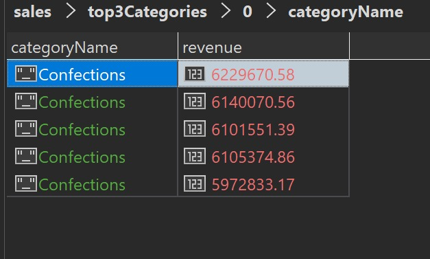
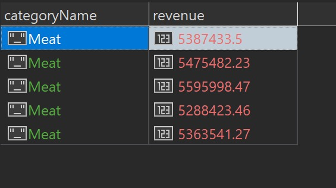
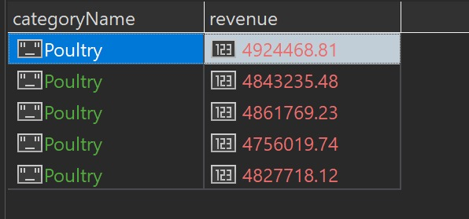

## Upiti

# 1. Koji su ukupni prihodi (TotalPrice) i prosečni popusti (Discount) za svaku kategoriju proizvoda po mesecima? Identifikovati najprofitabilnije kategorije i kategorije sa najvećim prosečnim popustom.

```
db.getCollection("sales_denormalized").aggregate([
  {
    $group: {
      _id: {
        year: { $year: '$SalesDate' },
        month: { $month: '$SalesDate' },
        category: '$Product.CategoryName'
      },
      totalRevenue: { $sum: '$TotalPrice' },
      averageDiscount: { $avg: '$Discount' }
    }
  },
  {
    $sort: {
      '_id.year': 1,
      '_id.month': 1,
      'totalRevenue': -1
    }
  },
  {
    $project: {
      _id: 0,
      year: '$_id.year',
      month: '$_id.month',
      category: '$_id.category',
      totalRevenue: { $round: ['$totalRevenue', 2] },
      averageDiscount: { $round: ['$averageDiscount', 2] }
    }
  }
]).explain("executionStats")
```

Rezultat upita:


Najprofitabilnije kategorije: Confections, Meat, Poultry
Prosečni popust: 3%
Vreme izvršavanja: 6.12s

# 2. Koji su top 5 najprodavanijih proizvoda (po Quantity i TotalPrice) u celom periodu, i koliki je procenat tih proizvoda označen kao IsAllergic?

```
db.getCollection("sales_denormalized").aggregate([
  {
    $group: {
      _id: '$Product.ProductID',
      productName: { $first: '$Product.ProductName' },
      isAllergic: { $first: '$Product.IsAllergic' },
      totalRevenue: { $sum: '$TotalPrice' },
      totalQuantitySold: { $sum: '$Quantity' }
    }
  },
  {
    $sort: { totalRevenue: -1 }
  },
  {
    $limit: 5
  },
  {
    $project: {
        _id: 0,
        productName: 1,
        totalRevenue: { $round: ['$totalRevenue', 2] },
        totalQuantitySold: 1,
        isAllergic: 1
    }
  }
])
```

Rezultat upita:


Procenat oznacen kao alergic je: 40%.
Vreme izvršavanja: 6.44s.

# 3.Kako se menjala ukupna prodaja (TotalPrice) i broj transakcija po danima u nedelji tokom celog perioda? Postoje li dani sa značajno većom ili manjom prodajom?

```
db.getCollection("sales_denormalized").aggregate([
  {
    $group: {
      _id: { $dayOfWeek: '$SalesDate' },
      totalRevenue: { $sum: '$TotalPrice' },
      numberOfTransactions: { $sum: 1 }
    }
  },
  {
    $addFields: {
      dayName: {
        $switch: {
          branches: [
            { case: { $eq: ['$_id', 1] }, then: 'Sunday' }, // MongoDB: 1 = Nedelja
            { case: { $eq: ['$_id', 2] }, then: 'Monday' },
            { case: { $eq: ['$_id', 3] }, then: 'Tuesday' },
            { case: { $eq: ['$_id', 4] }, then: 'Wednesday' },
            { case: { $eq: ['$_id', 5] }, then: 'Thursday' },
            { case: { $eq: ['$_id', 6] }, then: 'Friday' },
            { case: { $eq: ['$_id', 7] }, then: 'Saturday' }
          ],
          default: 'Unknown'
        }
      }
    }
  },
  {
    $sort: { '_id': 1 }
  },
  {
      $project: {
          _id: 0,
          dayOfWeek: '$_id',
          dayName: 1,
          totalRevenue: { $round: ['$totalRevenue', 2] },
          numberOfTransactions: 1
      }
  }
])
```

Rezultat upita:


Najviše prodaja: Utorak, Sreda, Četvrtak
Vreme izvršavanja: 3s.

Rezultat upita:

# 4.Postoji li korelacija između Class (klase proizvoda) i Resistant (otpornosti proizvoda) atributa i njihove ukupne prodaje (TotalPrice)? Koji Class/Resistant kombinacije ostvaruju najveći prihod?

```
db.getCollection("sales_denormalized").aggregate([
  {
    $group: {
      _id: {
        productClass: '$Product.Class', 
        productResistance: '$Product.Resistant' 
      },
      totalRevenue: { $sum: '$TotalPrice' },
      totalQuantitySold: { $sum: '$Quantity' }
    }
  },
  {
    $sort: { 'totalRevenue': -1 }
  },
  {
    $project: {
      _id: 0,
      productCombination: {
          class: '$_id.productClass',
          resistance: '$_id.productResistance'
      },
      totalRevenue: { $round: ['$totalRevenue', 2] },
      totalQuantitySold: 1
    }
  }
])
```

Rezultat upita:



Najprodavanija kombinacija: High/Durable
Vreme izvršavanja: 6.48s.
Pregledani dokumenti: "docsExamined" : 6690599.0

# 5.Koje su top 3 kategorije proizvoda po najvećem prihodu (po TotalPrice) u svakom od top 5 gradova po ukupnom prihodu?

```
db.getCollection("sales_denormalized").aggregate([
    {
        $group: {
            _id: {
                city: '$Customer.CityName',
                category: '$Product.CategoryName'
            },
            totalRevenue: { $sum: '$TotalPrice' }
        }
    },
    {
        $sort: { '_id.city': 1, 'totalRevenue': -1 }
    },
    {
        $group: {
            _id: '$_id.city',
            totalCityRevenue: { $sum: '$totalRevenue' },
            categories: {
                $push: {
                    categoryName: '$_id.category',
                    revenue: '$totalRevenue'
                }
            }
        }
    },
    {
        $sort: { 'totalCityRevenue': -1 }
    },
    {
        $limit: 5
    },
    {
        $project: {
            _id: 0,
            city: '$_id',
            totalCityRevenue: { $round: ['$totalCityRevenue', 2] },
            top3Categories: { $slice: ['$categories', 3] }
        }
    }
])
```

Rezultat upita:






Top 5 gradova: Tucson, Jackson, Sacramento, Fort Wayne, Indianapolis
Kategorije koje donose najveći prihod: Confections, Meat, Poultry
Vreme izvršavanja: 3.74s.
