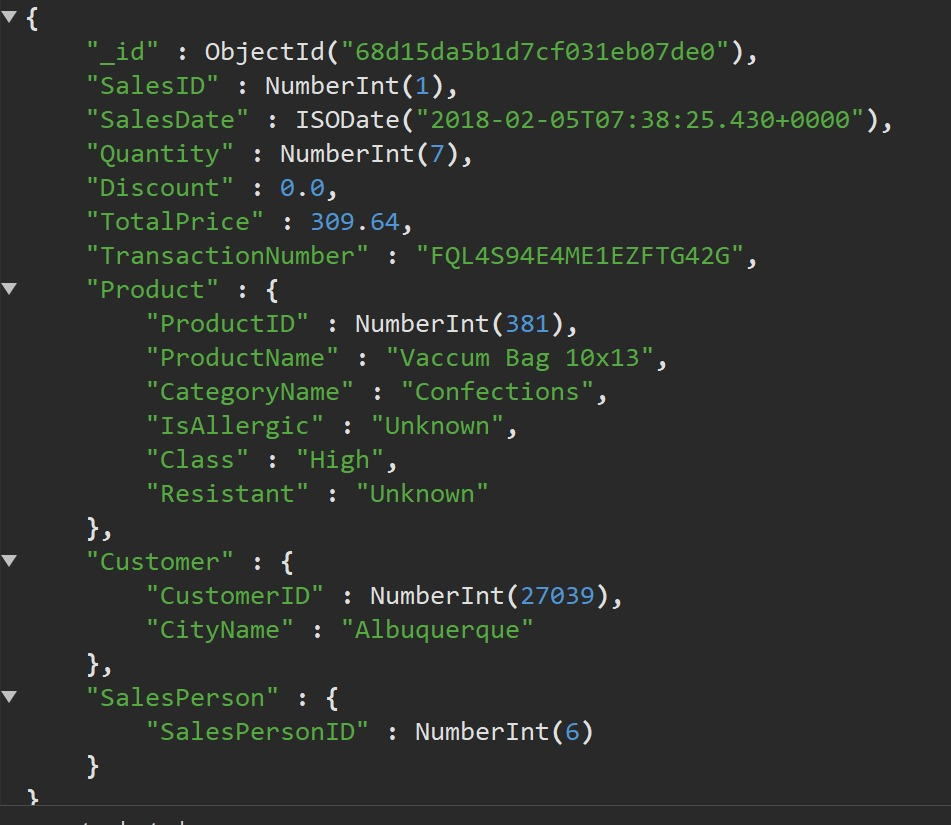

# Druga verzija šeme baza podataka

## Druga verzija šeme baze podataka sastoji se iz 4 stare kolekcije i nove denormalizovane kolekcije koja je napravljena prema upitima, radi bržeg izvršavanja:

1. **Kolekcija customers** sadrži podatke o kupcima.

2. **Kolekcija employees** sadrži podatke o zaposlenima.

3. **Kolekcija products** sadrži podatke o proizvodima.

4. **Kolekcija sales** sadrži podatke o prodajama proizvoda.

5. **Kolekcija denormalized_sales sadrži podatke neophodne za izvršavanje osmišljenih upita bez lookup i unwind funckija**

