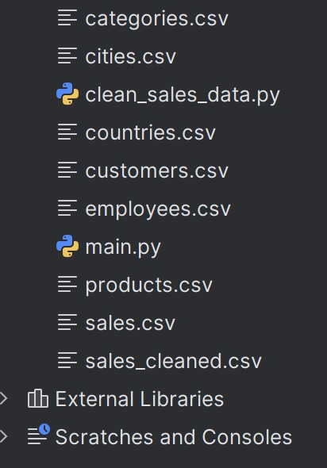

# Uputstvo za Pokretanje Projekta

## 1. Preduslovi

Pre pokretanja skripti, potrebno je obezbediti podatke i instalirati potrebne Python biblioteke.

### Podaci

Potrebne CSV datoteke možete preuzeti sa sledećeg linka:
[Grocery Sales Dataset na Kaggle-u](https://www.kaggle.com/datasets/andrexibiza/grocery-sales-dataset)

Sve preuzete `.csv` datoteke smestite u isti direktorijum u kojem se nalaze i `.py` skripte.

### Potrebne biblioteke

- **Pandas**
  ```bash
  pip install pandas
  ```
- **PyMongo**
  ```bash
  pip install pymongo
  ```
- **Os**
  - Ova biblioteka je deo standardne Python instalacije i nije je potrebno dodatno instalirati.

## 2. Struktura Direktorijuma

Primer preporučene strukture direktorijuma:



## 3. Koraci za Pokretanje

Pratite sledeće korake po navedenom redosledu:

1.  **Pokrenite skriptu za pretprocesiranje podataka.**
    Ova skripta čisti i priprema podatke za dalju obradu.

    ```bash
    python clean_sales_data.py
    ```

2.  **Pokrenite glavnu skriptu.**
    Nakon što se prethodna skripta uspešno izvrši, pokrenite glavnu skriptu koja će popuniti bazu podataka.
    ```bash
    python main.py
    ```
